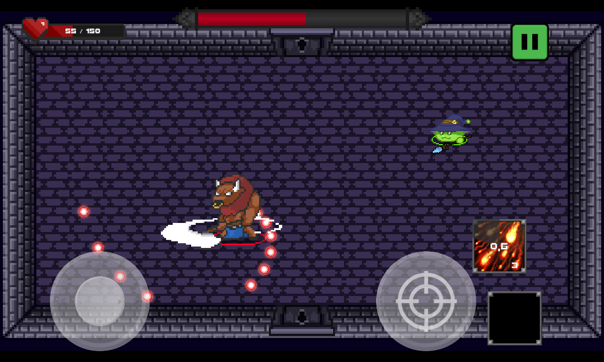

# Geeko-Game - Slime's Dungeon
## About Slime's Dungeon
Slime's Dungeon is a 2D Roguelite and Action Shooter Mobile Game developed using Unity and C#. Slime's Dungeon was developed and published during the discipline of "Projeto de Desenvolvimento de Jogos 2D".

## Avaliable At:

## Game Screenshot:

# Dependencies (Unity)
## Packages:
- Lightweight RP
- Shader Graph
- 2D Pixel Perfect
